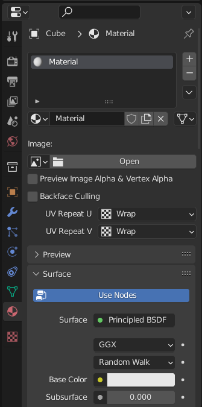
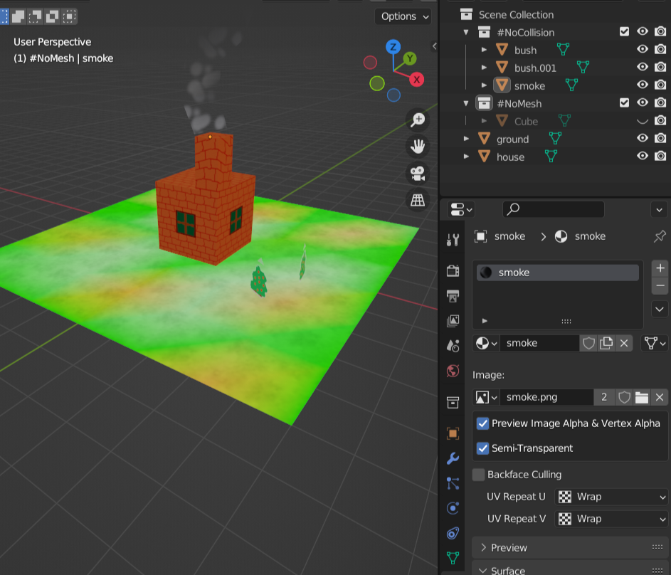
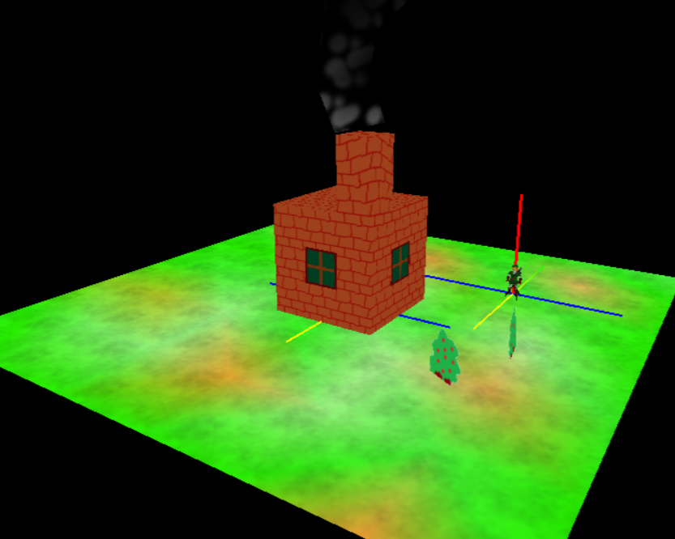
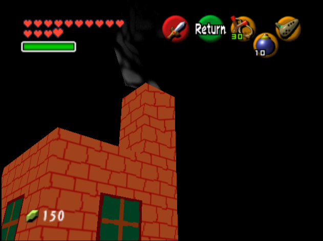
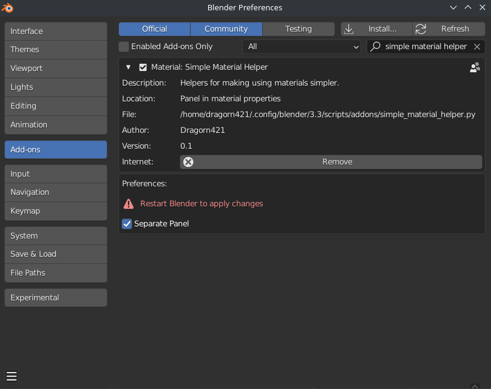

# Simple Material Helper

This is an addon for Blender 2.80+, confirmed to work with up to at least Blender 3.3.

It adds helpers for simplifying working with materials.

This is intended for use in the context of Zelda64 modding.

## Install

Download the `simple_material_helper.py` file from releases: https://github.com/Dragorn421/SimpleMaterialHelper/releases

Install that `simple_material_helper.py` file as an addon.

For how to install addons, see the Blender manual: https://docs.blender.org/manual/en/latest/editors/preferences/addons.html

## Videos

These demos also make use of export_obj_so which you can find at: https://github.com/z64tools/export_obj_so

[Full demo of using the addons with SharpOcarina for OoT64 modding (YouTube)](https://www.youtube.com/watch?v=qvEIb564tAM) (6 minutes) - [(download)](media/video_demo1_full.webm)

[Another demo, with a simpler room, modeling more slowly (YouTube)](https://www.youtube.com/watch?v=KUMaNqcViJU) (9 minutes) - [(download)](media/video_demo2_simple.webm)

(excuse me for the quality of the textures, I hastily drew them myself :p)

## Screenshots











## Usage

See the material properties. At the minimum, you need to set an image to use.

Note you should set the viewport shading to Material Preview to preview the materials.

If you don't want the panel to be stuck attached to the top of the material properties, you can disable that by going to the addon preferences, checking "Separate Panel" and restarting Blender. The panel will then be its own separate panel, labeled "Simple Material Helper".

## Notes for development

Create virtual environment, activate it and install `fake-bpy-module`:

```sh
python3 -m venv .venv
. .venv/bin/activate
pip install fake-bpy-module-latest
```

Create a link to the addon file in Blender's addons folder:

```sh
ln simple_material_helper.py ~/.config/blender/3.0/scripts/addons/
```
